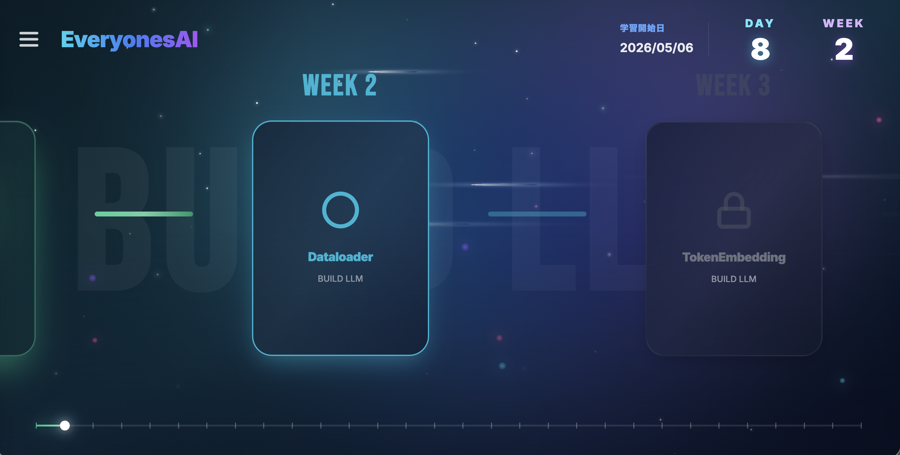
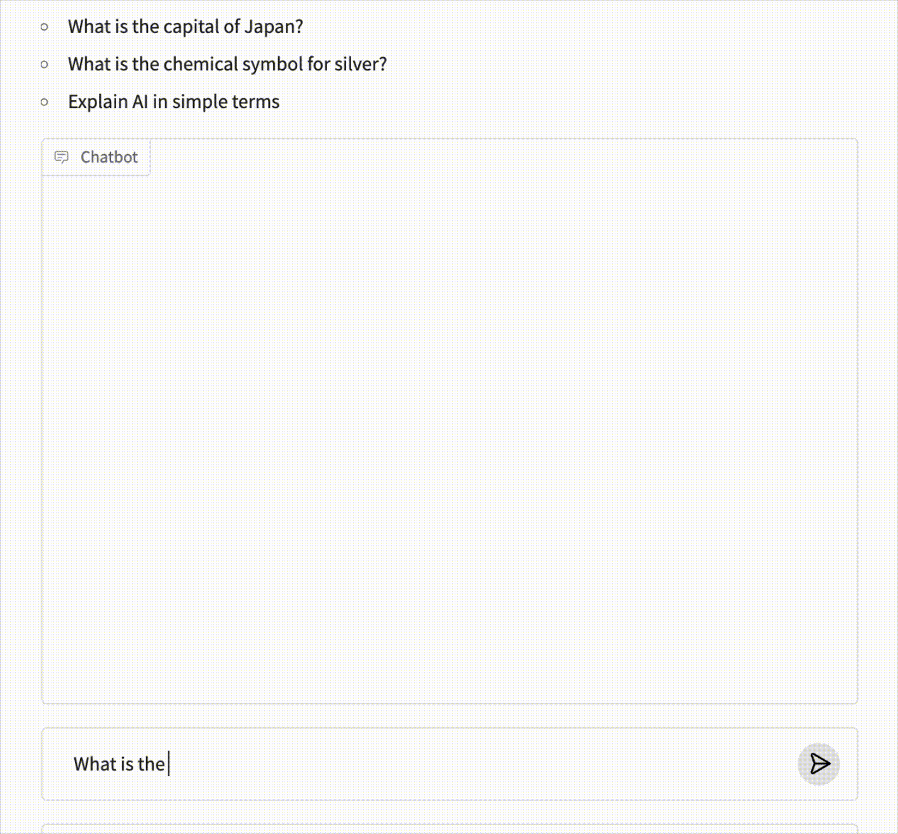

# **Everyones_nanoGPT 穴埋めノートブック・チュートリアル**

### [Webアプリで進めてみよう！](https://everyonesai-v2.created.app/)
> メールのみでログインできるようになっています。学習進捗を秘密にしたい場合、他人に自分のメールアドレスを教えてないでください。

これは、「ChatGPTが好き！」「自分でも作ってみたい！」という人のための完全ガイドです。 
「こんにちは！」と打てば「今日はどうしましたか？」と返してくれる。 
それが実は、ただの足し算掛け算と少しの非線形の積み重ねで動いていると知ったとき、 
ワクワクして夜も眠れなくなる―― 
ようこそ、ディープラーニングの世界へ。もう元には戻れません。 
このガイドは、毎日南北線のぎゅうぎゅうの席で、通学中に書きました。 
学生さんたちから「できた！」というコメントが届くたび、 
あの小さい席で過ごした時間に大きな意味があったんだなぁと感じています。

---

さあ、一緒にGPTモデルを作ろう！😎  
このチュートリアルでは、わかりやすい解説と**100問以上の穴埋め問題🫨**を用意しています。  
「ちょっとLLM作りたいからやってみたい」――そんな人が本気で力をつけられる内容です。  
必要な予備知識があれば、28〜42時間で修了可能！  
すべてGoogle Colab上で動かせます。  
このチュートリアルは[Andrej KarpathyさんのnanoGPT](https://colab.research.google.com/drive/1JMLa53HDuA-i7ZBmqV7ZnA3c_fvtXnx-?usp=sharing)と[jingyaogongさんのMinimind](https://github.com/jingyaogong/minimind.git)をベースにしています。  
この場を借りて、心から感謝します。

---

## 目次

### 基礎知識（ウォーミングアップ）

一度もMLPやVAEを実装したことがない😥...という方も安心してください！ 
ちょっとたいへんですが、このウォーミングアップをやれば準備万端です。 
すでに実装された経験のある方は、メインから始めてください。

| チャプター  | 推定所要時間 | ノートブック  |
|---|---|---|
| Chapter 01: MNIST MLP 1        | 2〜3時間 |  |
| Chapter 02:  MNIST MLP 2    | 1〜2時間 |  |
| Chapter 03:  cVAE | 2〜3時間 |  |

### ColabGPT

| チャプター  | 推定所要時間 | ノートブック  |
|---|---|---|
| Chapter 00: Start Tutorial      | 1〜2時間 |  |
| Chapter 01: Dataloader         | 1〜2時間 |  |
| Chapter 02: TokenEmbedding     | 0.5〜1時間 |  |
| Chapter 03: PositionEmbedding  | 0.5〜1時間 |  |
| Chapter 04: EmbeddingModule    | 0.5〜1時間 |  |
| Chapter 05: LayerNorm          | 1〜2時間 |  |
| Chapter 06: AttentionHead      | 3〜4時間 |  |
| Chapter 07: MultiHeadAttention | 1〜2時間 |  |
| Chapter 08: FeedForward        | 1〜2時間 |  |
| Chapter 09: TransformerBlock   | 0.5〜1時間 |  |
| Chapter 10: VocabularyLogits   | 0.5〜1時間 |  |
| Chapter 11: nanoGPT| 1〜2時間 |  |
| Chapter 12: Trainer            | 1〜2時間 |  |
| Chapter 13: Tokens per second(CPU)    | 1~2時間 |  |          |
| Chapter 14: Tokens per second(T4 GPU)     | 0.5〜1時間 |  |          |
| Chapter 15: Train nanoGPT with GPU    | 0.5〜1時間    |  |          |
| Chapter 16: モデルサイズだけ大きくする          | 0.5 ~ 1 時間 (+ モデル学習 1時間)  |  |          |
| Chapter 17:  データセットを大きくする    | 1〜2時間 (+ モデル学習 1時間) |  |          |
| Chapter 18: tiktoken      | 1〜2時間 (+ モデル学習 1時間)   |  |          |
| Chapter 19: Long Train    | 1〜2時間 (+ モデル学習 **6時間** )  |  |          |
| Chapter 20: 学習率            | 0.5〜1時間   |  |          |
| Chapter 21: Scaling Law       | 1〜2時間 |  |          |
| Chapter 22: TinyStories(メイン) | 1〜2時間   |  |          |
| Chapter 22: TinyStories(モデル学習) | 1時間   |  |          |
| Chapter 23: RPE(OverSimplified) | 2~3時間   |  |          |
| Chapter 24: RPE(Simplified)        | 1〜2時間 (+ モデル学習 1時間)      |  |
| Chapter 25: LR schedule      | 1時間      |  |
| Chapter 26: Checkpoint      | 1時間      |  |
| Chapter 27: Pretraining        | 0.5時間 (+ モデル学習 **20時間** )      |  |
| Chapter 28: Instruction Tuning        | 0.5時間 (+ モデル学習 0.5時間 )      |  |

## **デモ出力例**

Chapter28...!

---

## **Tensor Map（テンソル全体図）**
**下のテンソルマップを自分で作ってみよう！**  
ヒントもたくさん用意しているので安心してください。  
[CanvaでnanoGPTモデルのフル解像度Tensor Mapを見る](https://www.canva.com/design/DAGskS8QP6k/1zs7IklaMrB_LncHn2I8pA/edit?utm_content=DAGskS8QP6k&utm_campaign=designshare&utm_medium=link2&utm_source=sharebutton)

---

## **前提知識・スキル**

**理解してほしいこと**  
- 行列の掛け算と足し算  
- 平均値と分散  
- ResNetの残差接続（residual connection）  
- Word2Vectorの仕組み  

---

## **モデルについて**

このチュートリアルで使うのは、1文字＝1トークンという超シンプルな「バイグラムモデル」です。  
内部構造もかなり単純になっています。  
学習データセットはShakespeare（シェイクスピア）のテキスト。とても古いので著作権フリーです。

本物のGPT-2と比べると、ものすごく基本的な内容ですが、「基礎から学んで本物を目指す」にはこれがベスト。  
16GBメモリのPCなら、たった2〜4分のCPU学習だけでシェイクスピアっぽい文章が出てきます！  
きっと感動するはず！

---

## **開発環境について**

セットアップの手間を減らすため、サンプルはすべてGoogle Colab上で動かしてみてください。

ただしGoogle Colabでは、チェックボックスのマークが保存されません。  
進捗管理をしたい人や、30分ごとなど「ちょっとずつ進めたい」人には、VS Codeがおすすめです。  
その場合は、このリポジトリをforkして、自分のPCにcloneしてください。

Python 3.12 & PyTorch 2.6.0がベストですが、たいていは他のバージョンでも動きます。  
普通は、今インストールしているPyTorchでOK！  
もし動かない場合は `requirements.txt` で仮想環境を作ると良いです。  
Docker Desktopを使っている場合は、同梱の`Dockerfile`やDev Container拡張でさらに安定した環境を作れます。

---

## **解答**

| チャプター                                 | 推定所要時間                   | ノートブック                                                                                                                                                                                                                           |
| ------------------------------------- | ------------------------ | -------------------------------------------------------------------------------------------------------------------------------------------------------------------------------------------------------------------------------- |
| Chapter 00: Start Tutorial      | 1〜2時間 |  |
| Chapter 01: Dataloader         | 1〜2時間 |  |
| Chapter 02: TokenEmbedding     | 0.5〜1時間 |  |
| Chapter 03: PositionEmbedding  | 0.5〜1時間 |  |
| Chapter 04: EmbeddingModule    | 0.5〜1時間 |  |
| Chapter 05: LayerNorm          | 1〜2時間 |  |
| Chapter 06: AttentionHead      | 3〜4時間 |  |
| Chapter 07: MultiHeadAttention | 1〜2時間 |  |
| Chapter 08: FeedForward        | 1〜2時間 |  |
| Chapter 09: TransformerBlock   | 0.5〜1時間 |  |
| Chapter 10: VocabularyLogits   | 0.5〜1時間 |  |
| Chapter 11: nanoGPT| 1〜2時間 |  |
| Chapter 12: Trainer            | 1〜2時間 |  |
| Chapter 13: Tokens per second(CPU)    | 1~2時間                    |        |
| Chapter 14: Tokens per second(T4 GPU) | 0.5〜1時間                  |        |
| Chapter 15: Train nanoGPT with GPU    | 0.5〜1時間                  |        |
| Chapter 16: モデルサイズだけ大きくする             | 0.5 ~ 1 時間 (+ モデル学習 1時間) |        |
| Chapter 17: データセットを大きくする              | 1〜2時間 (+ モデル学習 1時間)      |        |
| Chapter 18: tiktoken                  | 1〜2時間 (+ モデル学習 1時間)      |        |
| Chapter 19: Long Train                | 1〜2時間 (+ モデル学習 **6時間** ) |        |
| Chapter 20: 学習率                       | 0.5〜1時間                  |        |
| Chapter 21: Scaling Law               | 1〜2時間                    |        |
| Chapter 22: TinyStories(メイン)          | 1〜2時間                    |   |
| Chapter 22: TinyStories(モデル学習)        | 1時間                      |  |
| Chapter 23: RPE(OverSimplified)        | 2~3時間                     |  |
| Chapter 24: RPE(Simplified)        | 1〜2時間 (+ モデル学習 1時間)      |  |
| Chapter 25: LR schedule        | 1時間     |  |
| Chapter 26: Checkpoint        | 1時間     |  |
| Chapter 27: Pretraining        | 0.5時間 (+ モデル学習 **20時間** )      |  |
| Chapter 28: Instruction Tuning        | 0.5時間 (+ モデル学習 1時間 )      |  |

**清書前追加**

| チャプター                                 | 推定所要時間                   | ノートブック                                                                                                                                                                                                                           |
| ------------------------------------- | ------------------------ | -------------------------------------------------------------------------------------------------------------------------------------------------------------------------------------------------------------------------------- |
| Chapter 25: RoPE        |                      |  |
| Chapter 26: Pretraining        |       |  |
| Chapter 27: Instruction Tuning        |       |  |
| Chapter 28: Vision Pretraining        |       |  |

## **Project EveryonesAIについて**

  
  
  
  
